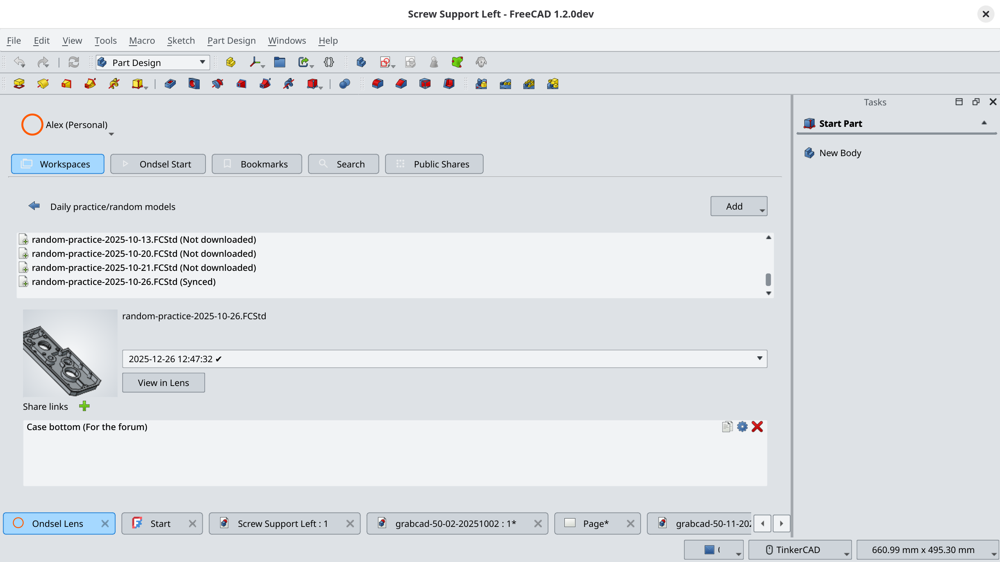

With the Ondsel Lens addon for FreeCAD, you can collaborate on product designs with other team members: check out parts, create their revisions, and reuse existing parts in new assemblies.

The addon can establish connections to multiple servers running Ondsel Lens, so you can easily switch between work and personal projects.


  
