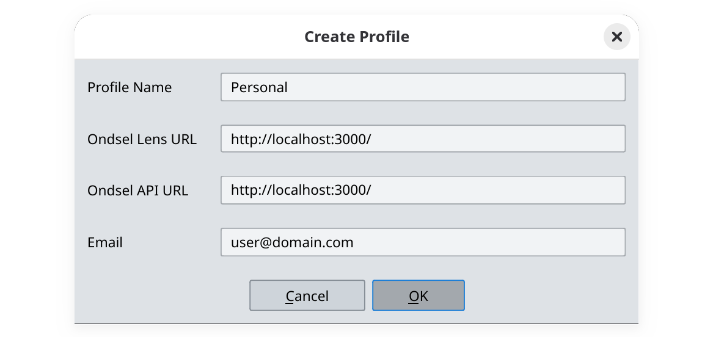
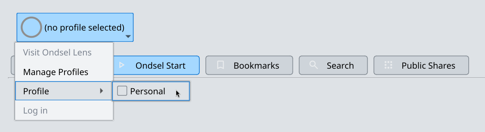
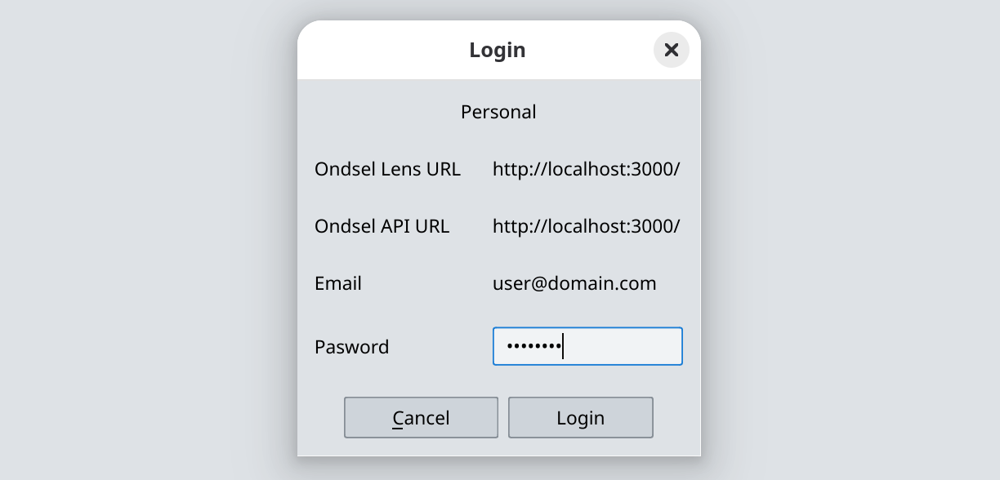
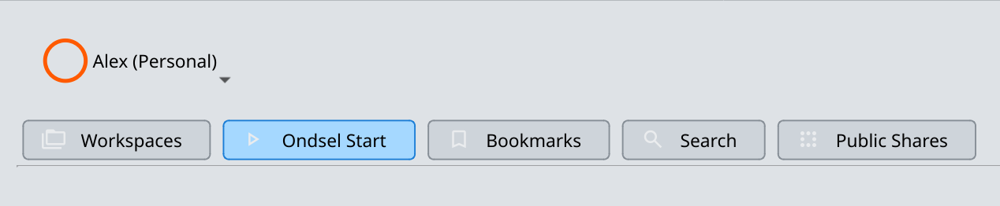
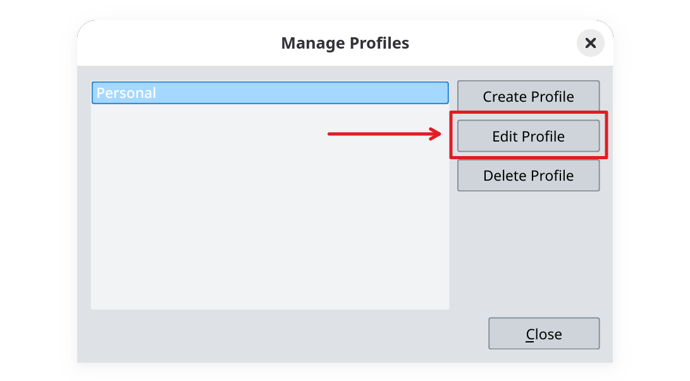
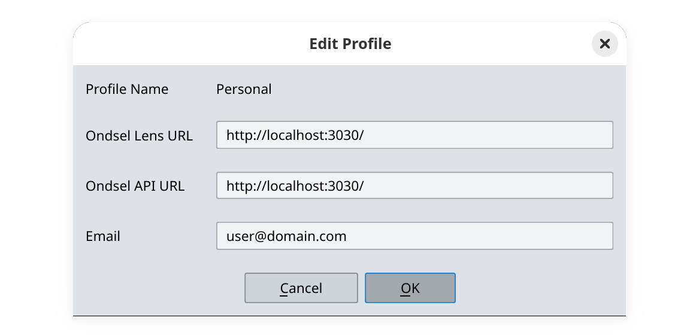
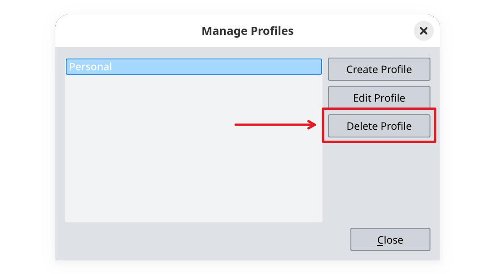

## Create profile

To start collaborating on designs, you need to connect to an Ondsel Lens server. To do that, you need at least one connection profile. Follow these steps to create one:

1. Click on **(no profile selected)** at the top of the Lens window in FreeCAD and select **Manage Profiles**.

2. In the newly opened dialog, click on **Create Profile**.
3. Set the name of the profile that will be displayed in the drop-down list in the Ondsel Lens UI. Try to give it a meaningful name.

 
  Please note that you cannot rename a profile in the future.


4. Insert the URL of the Lens server and the Lens API. For locally running instance of Lens, both will likely be `http://localhost:3000/`.
5. Submit the email you registered on Ondsel Lens with and click **OK**.

6. Click on **Close** to quit the profile management in Lens.

## Connect to a server

1. Click on the drop-down list at the top of Ondsel Lens UI, then select **Profile > {name of a profile}**. The color of the Lens addon logo will change to green.

2. Click on the drop-down list at the top of Ondsel Lens UI, then select **Log in**.

3. Submit the password in the newly opened dialog and click on **Login**.

4. The Lens addon will attempt to connect to the server and change the icon color to orange in case of success.

## Edit profile

You can change most parameters of an existing connection profile. To do that, follow these steps: 

1. Click on the Lens menu and select **Manage Profiles**.

2. Select a profile and click on **Edit Profile**.

3. You can change Ondsel Lens URL, Ondsel API URL, and the email address in the profile. The name cannot be changed.

4. After changing the settings, click on **OK** and then close the **Manage Profiles** window.

## Delete profile

You can delete an existing connection profile. To do that, follow these steps: 

1. Click on the Lens menu and select **Manage Profiles**.

2. Select a profile and click on **Delete Profile**.

3. Click on **Yes** in the confirmation window and then close the **Manage Profiles** window.