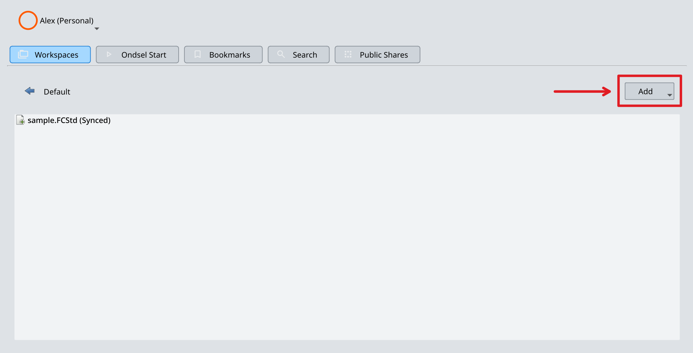
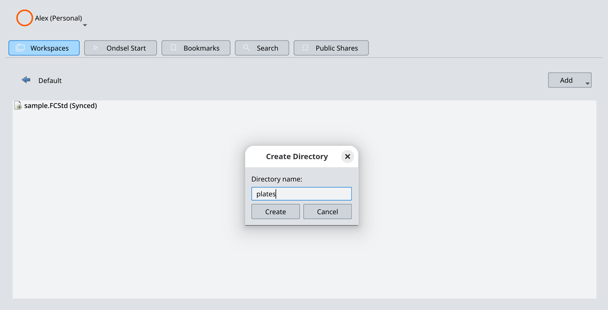
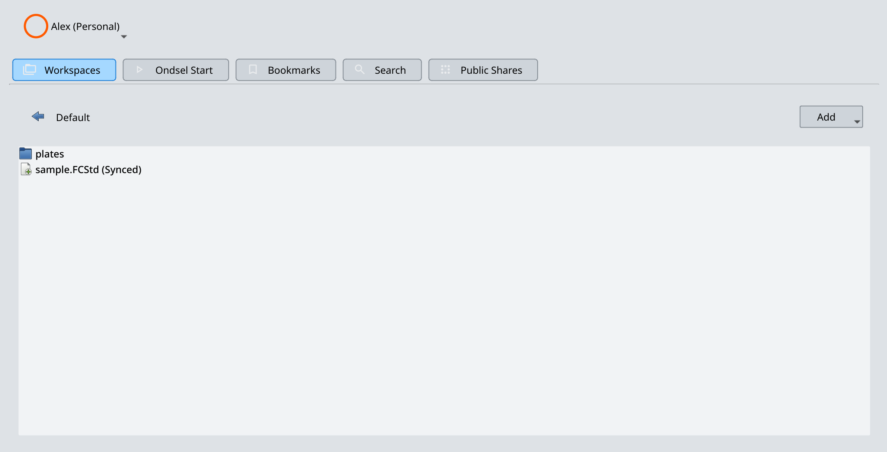

To create a new directory in a workspace, follow these steps:

1. Navigate to the workspace and the directory where you want to create a new directory.

2. Click on the **Add** drop-down list on the right and select **Add a directory**.

3. Enter the name for a new directory and click on **Create**.

The workspace now contains the directory you just added:

