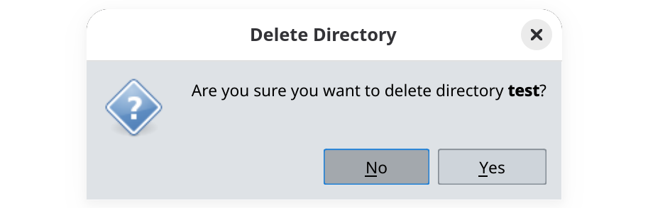

To delete a directory and all its files from a workspace, follow these steps:

1. Navigate to the directory of interest.

2. Select and delete all its files locally and remotely [as explained here](../delete-files), one by one.

3. Go one level up, right-click on the name of the directory, and select **Delete Directory**.

4. Click on **Yes** to confirm the deletion.

The list of availble directories will update immediately.