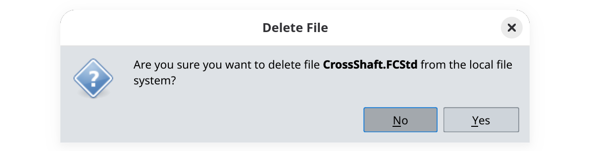
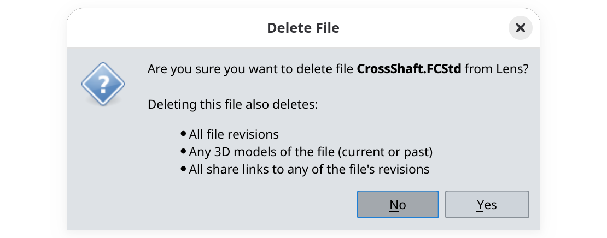

Deleting files in the addon is a two-step process: first you delete a local copy, then you delete the remote file. Deleting both is a prerequisite for [deleting entire directories](../delete-directories).

{}

### Delete the local file

Select a file inside it, right-click, then select **Delete File** and confirm the deletion by clicking on **Yes** in the conformation window. This will remove it from the local cache directory.

### Delete the remote file

Right-click on the file again and select **Delete file**, confirm the deletion by clicking on **Yes**.

This will remove:

- all file revisions,
- any 3D models of the file ([see here](/webapp/key-concepts/files-vs-models/) for explanation of the difference between files and models),
- all share links associated with the file.

{}