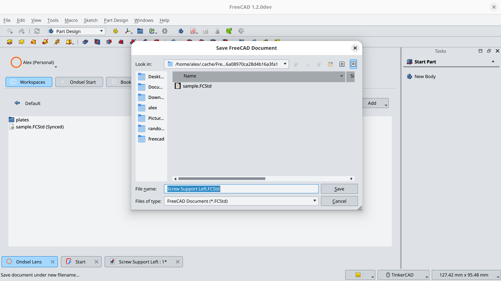
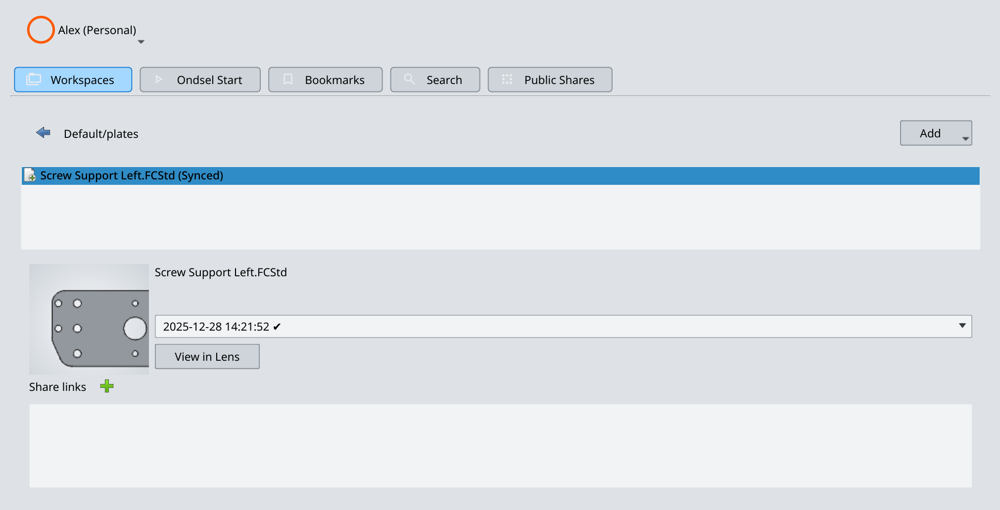
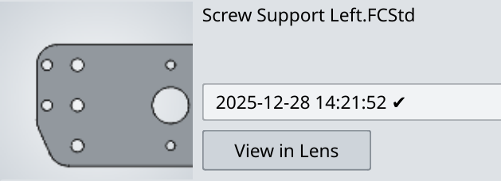
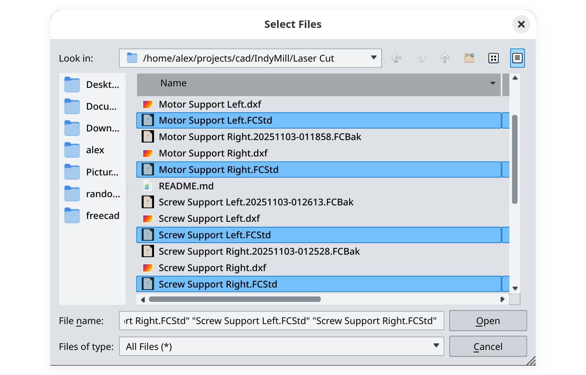
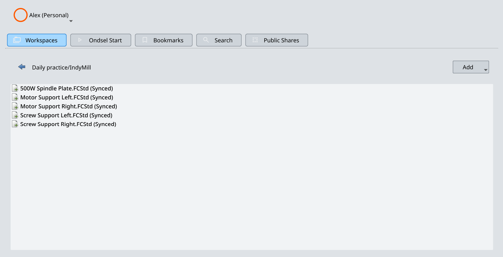

There are two ways to upload new files to your Ondsel Lens workspace.

## Upload the current file

1. Open a FCStd file you recently worked on and switch back to the **Ondsel Lens** window.

2. Navigate to the directory where you want to store this file.

3. Click on the **Add** drop-down list on the right and select **Add current file**. This will open a prompt to save the file to the cache folder where the addon will keep the local copy of all files on Ondsel Lens.


  For Ondsel Lens, the current file is the one you last visited among multiple currently opened ones.


4. After you save the file, it will become visible in the workspace, and the comment for it will say "Synced". This means your local file and the file on Ondsel Lens are the same.

The panel in the middle of the window displays the preview for the current version of the file and its timestamp:

## Upload a file from disk

1. Switch back to the **Ondsel Lens** window and navigate to the directory where you want to store a file from disk.

2. Click on the **Add** drop-down list on the right and select **Select files…**. This will open a prompt to pick one or multiple file from the disk.

3. Navigate to a folder with files, select the one you want to upload, and click on **Open**.

4. Files will be uploaded and will show up in the directory on Lens. The comment for it will say “Synced”. This means your local file and the file on Ondsel Lens are the same.

