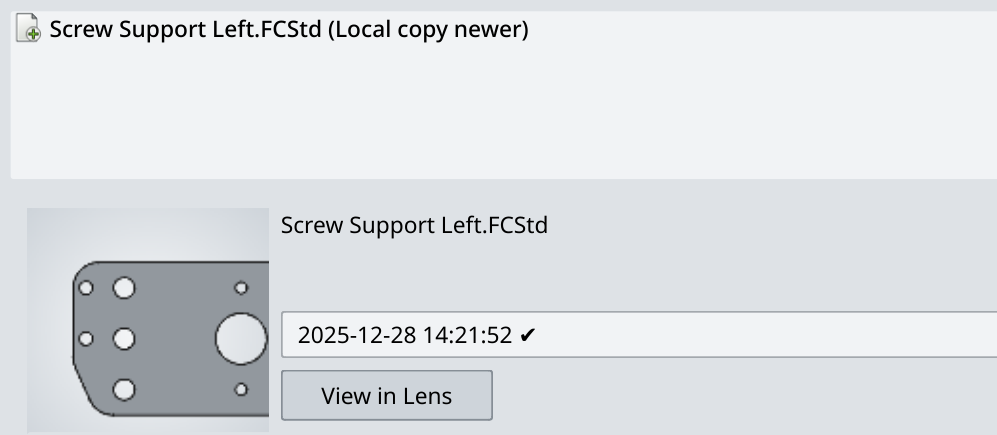
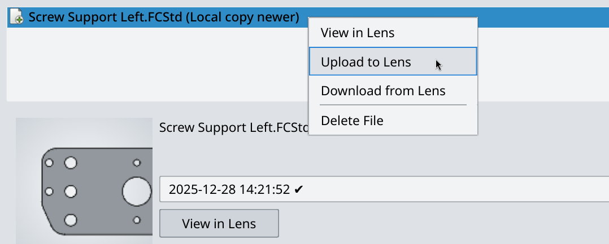
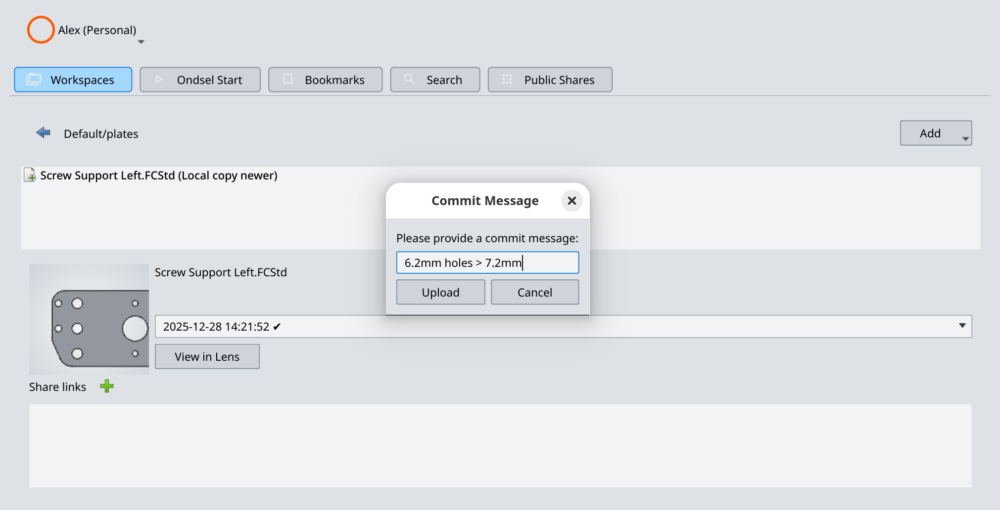

## What a new version means

Design iterations are best done in small, atomic steps, so that it's easy to single out a version that introduced a specific change later on.

Saving a file tracked by Ondsel Lens creates a new physical file locally. This makes the local and the remote storages temporarily out of sync.

Uploading a new version means:

1. Creating a remote copy of the new local file (that represent a new version) on Ondsel Lens.
2. Updating Ondsel Lens's database to reference the new version and set it as the active one.
3. Marking the file as "Lens copy newer" for everyone who has access to the workspace through the FreeCAD addon.
4. Marking the file as "Synced" in the FreeCAD addon for _you_.

## Creating a new version

To create a new version of a design, follow these steps:

1. Make a change in your design and save the file. Go back to the **Ondsel Lens** window. The file will have the "Local copy newer" [status](../../manage-files/sync-status/).

2. Right-click on the file and select **Upload to Lens**.

3. Enter a commit message and click **Upload**. When you write the commit message, make it descriptive enough so that anyone looking through the revision can single out the version when a specific aspect of the design changed.

The status of the file will change to "Synced".