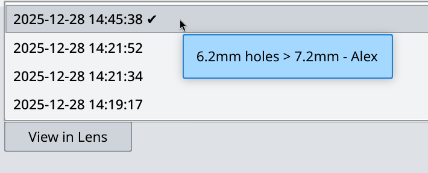

You can open any older version you created. To do that, follow these steps:

1. Select the file where you want to open an ealier version.

2. Click on the versions drop-down list and select another version (this will also change the file status to "Lens copy newer").

3. Double-clicking this file will now open the version you selected.