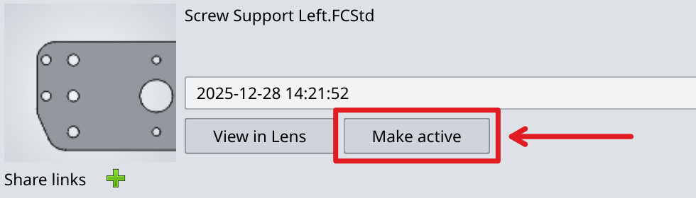
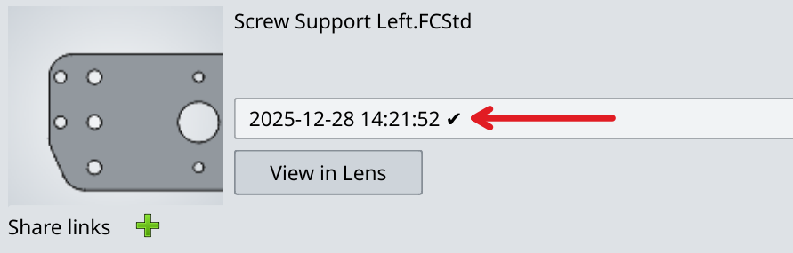

Active versions are the ones opened and rendered by default in both FreeCAD and the web app. The active version has a small checkmark to the right of its timestamp in the addon user interface.

Unless you choose otherwise, the latest version is the active one. However, you can set an earlier version as the active one while preserving newer versions. To do that, follow these steps:

1. Select the file where you want to set an earlier version as the active one.

2. Click on the versions drop-down list and select another version (this will also change the file status to "Lens copy newer").

3. Click on the **Make active** button.

4. The selected version will be marked as the active one with a checkmark, the syn status will change to "Synced".

Creating a new version based on this active one will simply create a new version on top of the latest one.

All versions you ever made will be preserved. Any one of them can be set as the active one.