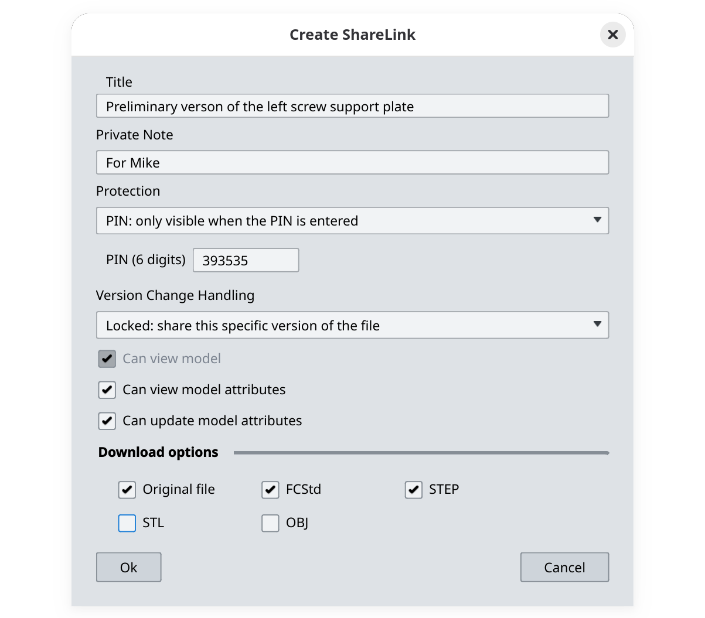
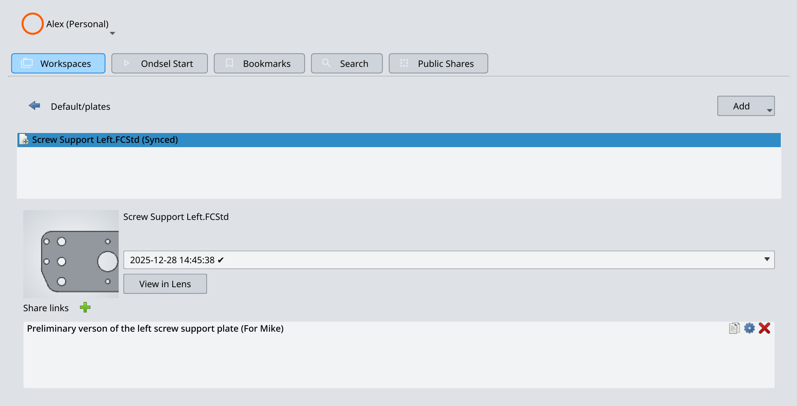

To create a share link, follow these steps:

1. Click on the file you want other people to see and click the **+** button next to **Share links**:

2. Set share link parameters:

**Title**: This is a user-visible name of the share link.

**Private note**: This is an optional field that only you will see. It's handy for storing informations such as the reason for creating the share link or who it is intended for. Months and years later, private notes can help understand which share links are safe to remove and which aren't.

**Protection method**: This is #1 setting to define who can see and interact with the model you shared. Available options are:

- **Listed**: The model associated with this share link will show up in the list of public links on the Ondsel Server. Anyone who can access the server will be able to see it.

- **Unlisted**: The model associated with this share link will _not_ show up in the list of public links on the Ondsel Server. However, anyone who can access the server will be able to see it as long as they have the share link.

- **PIN**: Anyone who has a six-digit PIN code can access the model associated with this share link and interact with it.

**Version Change Handling**: This setting defines whether the share link should always open the latest active version or stay associated with a specific version.

**Can view model**: This option is non-negotiable.

**Can view model attributes**: If the design is parametric and uses VarSets, enabling this option will list available parameters without being able to change them.

**Can update model attributes**: If the design is parametric and uses VarSets, enabling this option will make it possible to customize the model in the browser and watch it update live.

**Download options**: Here you can define which file formats should be downloadable for anyone with this share link. Since Ondsel Lens allows uploading any files, this section has a separate "Original" checkbox so that the file can downloaded in whatever original format it has, without conversions.

3. Once you're done, click on **OK**. This will create a share link:

