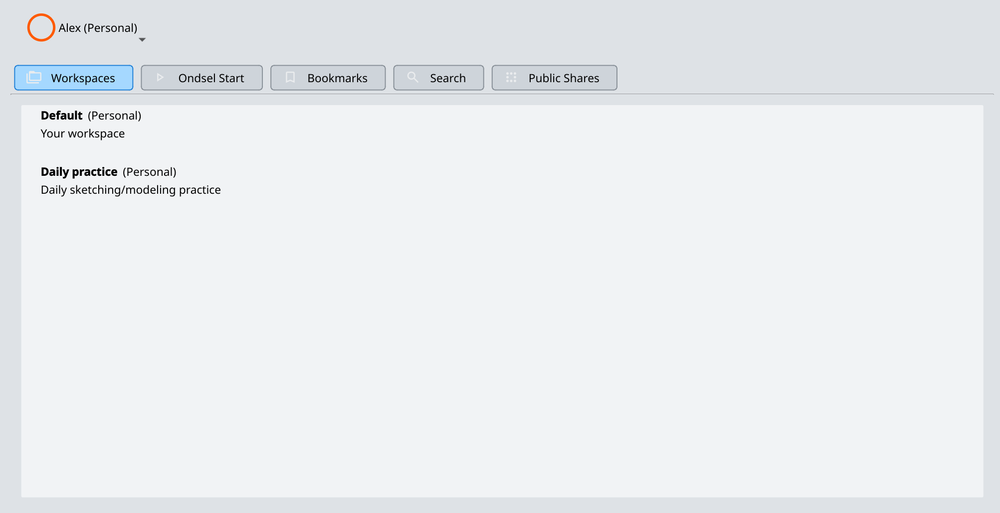
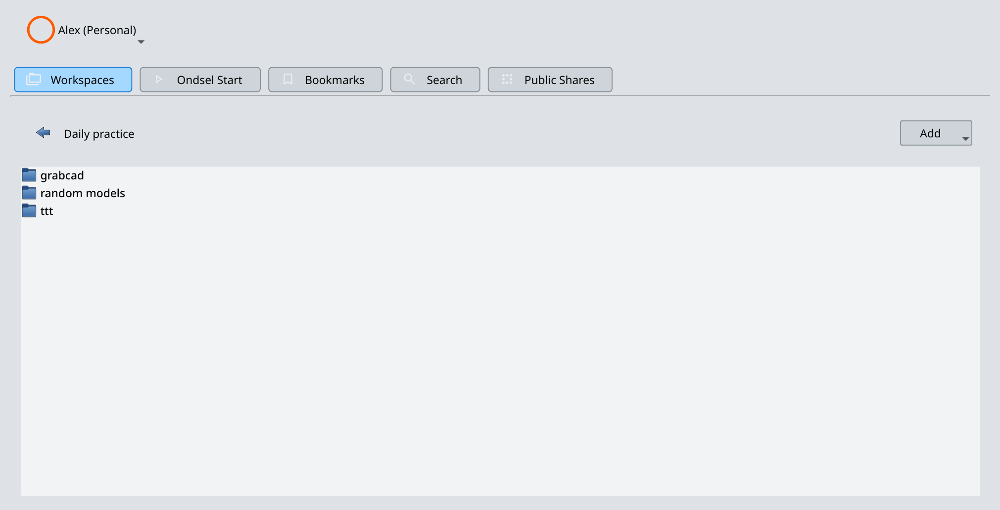

The Ondsel Lens addon provides basic navigation over workspaces available to a user.

By the default, the **Workspaces** lists workspaces from all organizations that a user is member of. The name in bold is the name of the workspace, the name in the parentheses is the organization this workspace belongs to.

Double-clicking on the name of a workspaces opens the list of directories and files in this workspaces.

To go one level back, click on the left-pointing arrow above the list of files and directories. The caption to the right of the button displays the full path to the currently open directory.