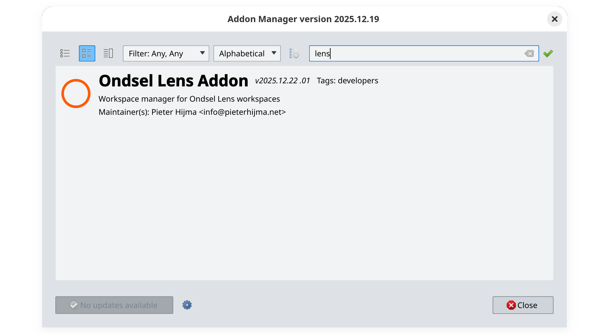
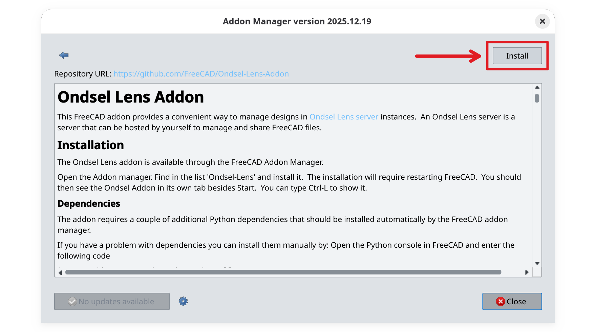
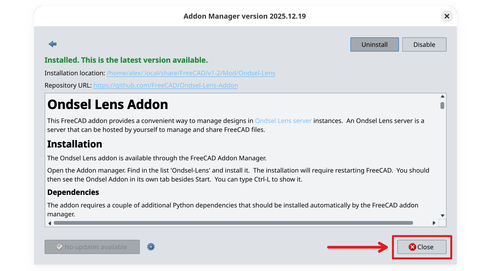
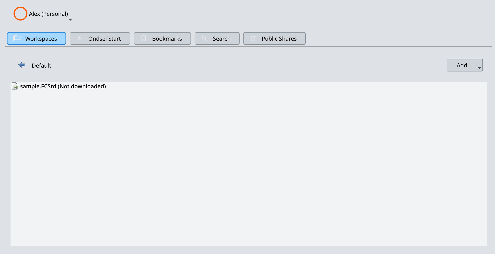
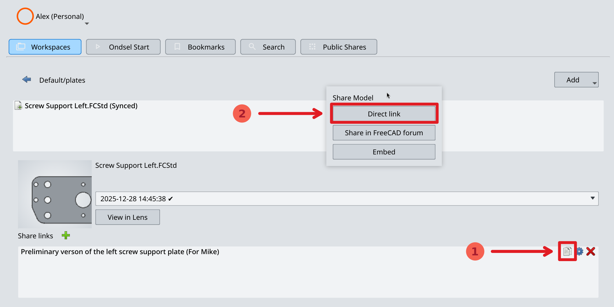

This help page will guide you through installing the Lens addon, uploading your first design to a workspace, and sharing it with others.

{}

### Install the addon

To install the Ondsel Lens addon on FreeCAD, follow these steps:

1. Launch FreeCAD and choose **Tools > Addon Manager** in the main menu.
2. Type “Lens” in the search box at the top of the dialog and click on the Ondsel Lens Addon item.

3. Click on **Install** at the top right.

4. Click on **OK** in the dialog that confirms successful addon installation.
5. Click on **Close** and then choose **Restart Now** to restart FreeCAD.

6. FreeCAD will automatically reopen with the Lens addon enabled.

### Create a connection profile

You need at least one connection profile to start collaborating on designs.

1. Click on **(no profile selected)** at the top of the Lens window in FreeCAD and select **Manage Profiles**.

2. In the newly opened dialog, click on **Create Profile**.

3. Set the name for the profile. Pick a meaningful name and keep in mind that you cannot rename the profile in the future.

4. Insert the URL of the Lens server and the Lens API. For a local server, try `http://localhost:3000/`.

5. Submit the email you registered with and click **OK**.

6. Click on **Close** to quit the profile management in Lens.

### Log into the Lens server

1. Click on the Lens menu and select **Profile > {name of the profile}**.

2. Click on the Lens menu again and select **Log in**.

3. Submit the password and click on **Login**.

4. The Lens addon will attempt to connect to the server and change the icon color to orange in case of success.

### Open a workspace

1. Click on **Workspaces** in the Lens toolbar on the left. This will list workspaces available in the default organization. The name in bold is the name of the workspace, the name in the parenthesis is the organization this workspace belongs to.

2. Double-click on **Default (Personal)**. This will open the list of folders and files in this workspaces. By default, there's only a sample project in this folder.

### Create a new directory

1. Click on the **Add** drop-down list on the right and select **Add a directory**.

2. Enter the name for a new directory and click on **Create**.

The workspace now contains the directory you have just added:

Double-click it to navigate into it.

### Upload a file

1. Open a FCStd file you recently worked on and switch back to the **Ondsel Lens** window.

2. Click on the **Add** drop-down list on the right and select **Add current file**. This will open a prompt to save the file to the cache folder where the addon will keep the local copy of all files on Ondsel Lens.

3. After you save the file, it will become visible in the workspace, and the comment for it will say "Synced". This means your local file and the file on Ondsel Lens are the same.

The panel in the middle of the window displays the preview for the current version of the file and its timestamp:

### Create a new version

1. Make a change in your design and save the file. Go back to the **Ondsel Lens** window. The file will now be marked as "Local copy newer".

2. Right-click on the file and select **Upload to Lens**.

3. Enter a commit message and click **Upload**. When you write the commit message, make it descriptive enough so that anyone looking through the revision can single out the version when a specific aspect of the design changed.

The status of the file will change to "Synced".

### Create a share link

It's time to create the first share link so that other people can take a look at your model.

1. Click on the file you want other people to see and click the **+** button next to **Share links**:

2. Set share link parameters:

- the title for the link,
- an optional private note that only you will see (e.g., the reason for creating the share link or who it is intended for),
- protection method (choose any that applies best for the reason you are sharing the model),
- choose whether the share link should always open the latest active revision or stay associated with a specific version,
- select which file formats should be downloadable, if any.

3. Once you're done, click on **OK**. This will create a share link:

4. Click on the **Copy** button to the right of the share link (the left one in a group of three) and select the **Direct Link** option in the menu.

This will copy the share link to the clipboard. You can paste it into a messenger app or an email.

{}