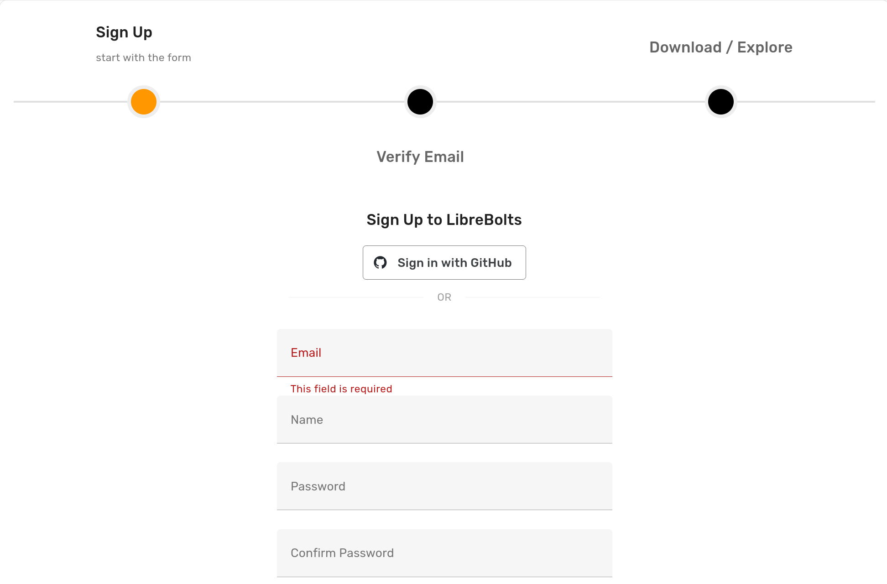

To enable authentication with GitHub OAuth on an Ondsel Lens instance, follow these steps:

{}

### Enable GitHub OAuth

1. Open the [Lens dashboard](/administration/dashboard) and click on **OAuth Configuration**.
2. Click on **Enable GitHub OAuth**.
3. Copy the Redirect URI to the clipboard.

### Create OAuth app on GitHub

1. On your GitHub organization page, click on **Settings**.
2. In the left sidebar, click on **Developer settings** and then **OAuth Apps**.
3. Click on **New OAuth App**.
4. Set the application name, homepage URL, and insert the redirect URI to the **Authorization callback URL** field.
5. Click on **Register application**.

### Create a new client secret

1. On the general settings page of the newly created OAuth app, click on **Generate a new client secret**.
2. Keep the page open.

### Insert credentials

Copy and paste the client ID and the the client secret to respective fields in the GitHub API settings section of the Lens dashboard.

### Save settings

On the OAuth Configuration settings page, click on **Save**. The authentication page will now show the **Sign in with GitHub** option.

{}

Users should now be able to register and log in with their GitHub credentials.