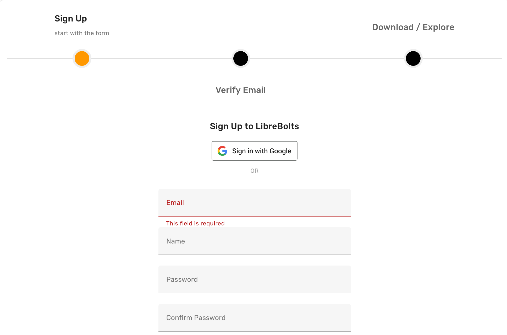

To enable authentication with Google OAuth on an Ondsel Lens instance, follow these steps:

{}

### Create credentials

1. Log into the Google Cloud Console and go to your project.
2. Go to the Credentials tab.
3. Click on **+ Create credentials** and select **OAuth client ID**.
4. Select the **Web Application** type (you can follow the steps outlined in the [FeatherJS tutorial](https://feathersjs.com/cookbook/authentication/google#application-client-and-secret)).
5. Copy and paste the Client ID and Client Secret elsewhere or keep the confirmation window open.

### Enable Google OAuth

1. Open the [Lens dashboard](/administration/dashboard) and click on **OAuth Configuration**.
2. Click on **Enable Google OAuth**.

### Insert the credentials

1. Insert the Client ID and Client Secret from Google Cloud Console.
2. Copy the Redirect URI.
3. On the credentials settings page of Google Cloud Console, click on **+ Add URI** and insert the Redirect URI.

### Save settings

On the Google OAuth settings pages, click on **Save**. The authentication page will now show the **Sign in with Google** option.

{}

Users should now be able to register and log in with their Google credentials.