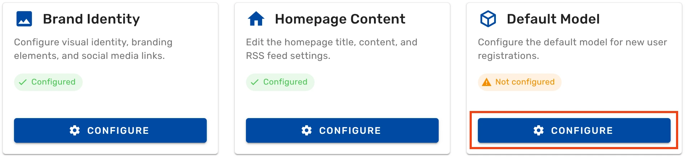
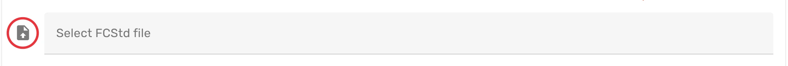
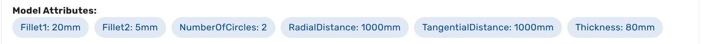

Ondsel Lens servers use a default model as sample content when you initialize a new organization and workspace.

To define your own default model, follow these steps:

{}

### Open the dashboard

[Open the dashboard](../../dashboard) and click on **Branding Configuration**.

### Open the Default Model section

On the **Branding Configuration** page, find the **Default Model** section, and click on the **Configure** button.

### Upload new default model

Scroll to the bottom and click here to select an FCStd file (FreeCAD) as a new default model for organizations and workspaces.

After that, click on the **Upload model** button to submit the file you selected.

### Review changes

The dashboard will render the preview for the model you have just uploaded. If the model you uploaded is parametric and uses VarSets, the page will also list available parameters under **Model Attributes**. 

{}

 
  Once you upload your own default model, you can only replace it with a new default model file. If you want to go back to the factory default model (Ondsel logo), [download the file](https://github.com/FreeCAD/Ondsel-Server/blob/main/backend/uploads/sample.FCStd) and upload it again.
