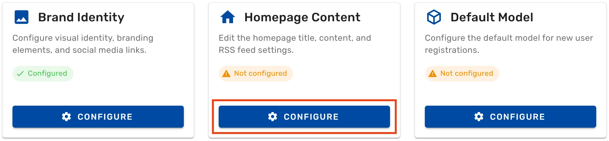
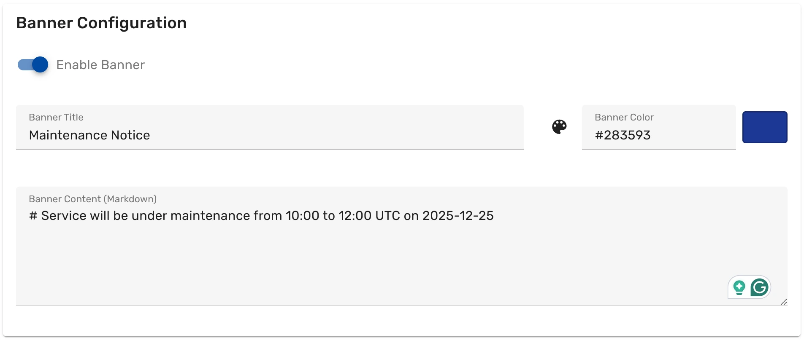
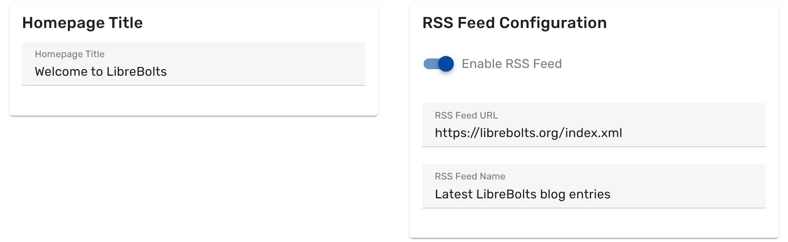
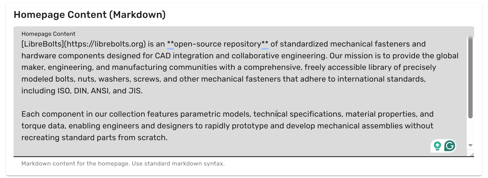

To configure the homepage of your Ondsel Lens server, follow these steps:

{}

### Open the dashboard

[Open the dashboard](../../dashboard) and click on **Branding Configuration**.

### Open the Homepage Content section

On the **Branding Configuration** page, find the **Homepage Content** section, and click on the **Configure** button.

### Configure the banner

If you need to display a temporary message on the homepage, such as a maintenance message, click on **Enable Banner** and change the text of the message and, optionally, the background color of the banner.

### Change the title

Click on **Homepage Title** and change the text.

### Change RSS feed settings

Ondsel Lens defaults to displaying the latest 7 blog entries from the FreeCAD blog. You can change the link to RSS feed and set a different title.

To disable the RSS feed on the homepage, click on **Enable RSS Feed**.

### Change the homepage content

Insert your own welcome message that describes your Ondsel Lens server. You can use Markdown formatting, such as `**bold**` and `_italic_`, `## heading`, `[anchor text](url)`, etc.

### Preview changes

Preview all the changes you've done so far and tweak settings where required.

### Save changes

Click on **Save changes** at the bottom. All modifications will apply immediately.

The first time you change homepage content, the status of the **Homepage Content** section on the **Branding Configuration** page will change from **Not configured** to **Configured**.

{}
