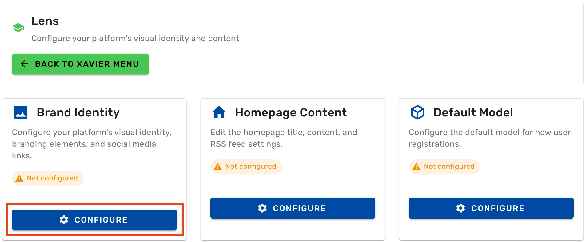
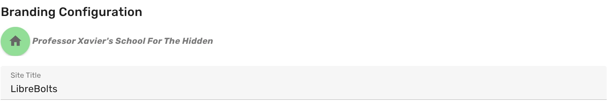
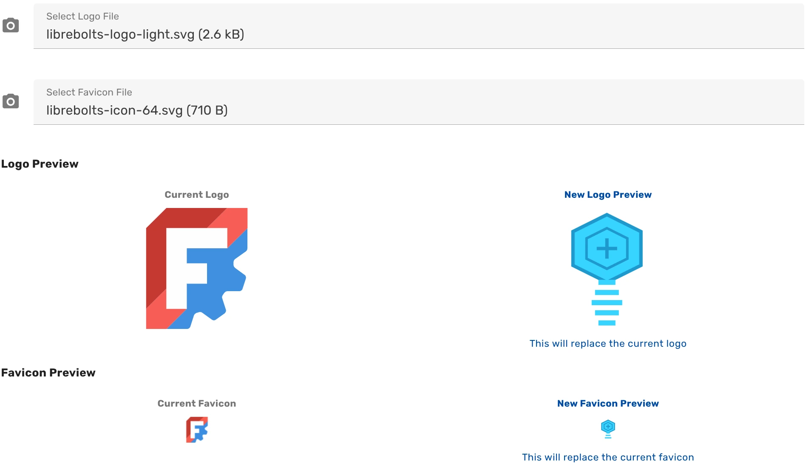
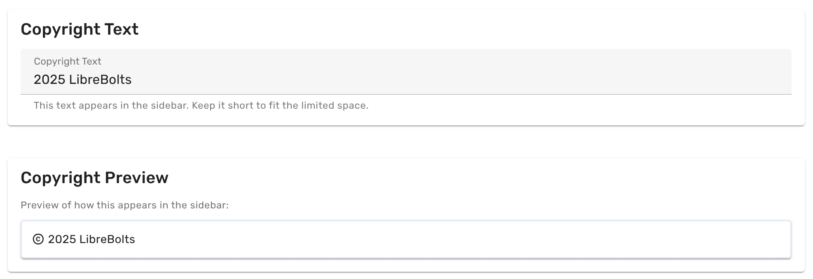
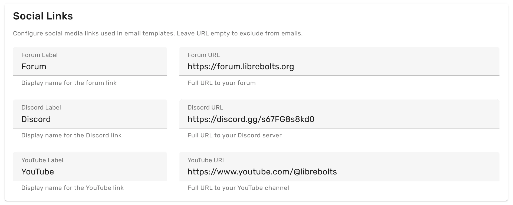

To configure brand identity of your Ondsel Lens server, follow these steps:

{}

### Open the dashboard

[Open the dashboard](../../dashboard) and click on **Branding Configuration**.

### Open the Brand Identity section

On the **Branding Configuration** page, find the **Brand Identity** section, and click on the **Configure** button.

### Set Lens instance title

Click in the **Site Title** field and type the new title for your Ondsel Lens server. This is what will show up in the caption of your browser tab.

### Set the logo and favicon

Click on the camera icon for **Select Logo File** and point your browser to the logo file in SVG or PNG file format. The logo will be displayed in the navigation sidebar on the left and on the homepage.

Repeat this for **Select Favicon File**. This is the small version of the logo that will be displayed in the browser tab next to the server's title.

Once you select both images, the dashboard will render the preview below, next to the current logo and favicon.

### Set the copyright text

Click on the **Copyright Text** field and set the new text that will be displayed at the bottom of the navigation sidebar on the left.

The preview for the copyright text will be rendered below:

### Set social links

Set the links to your forum, Discord channel, and YouTube channel. They are currently not displayed in the dashboard or on the public organization page, but they can be used in email templates.

{}

