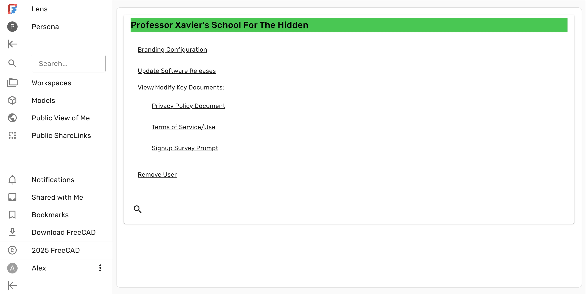

The user interface for removing users is located in a hidden section of the webapp:

```
<lens host url>/xavier-68373833
```

E.g., for a locally running instance built with Docker, it would be [localhost:3000/xavier-68373833](http://localhost:3000/xavier-68373833).



The dashboard allows you to:

- [Configure the branding](../branding) of your Lens instance
- [View and modify key documents](../documents), such as privacy policy, terms of service, and signup survey prompt
- [Remove registered users](../remove-users) from the system