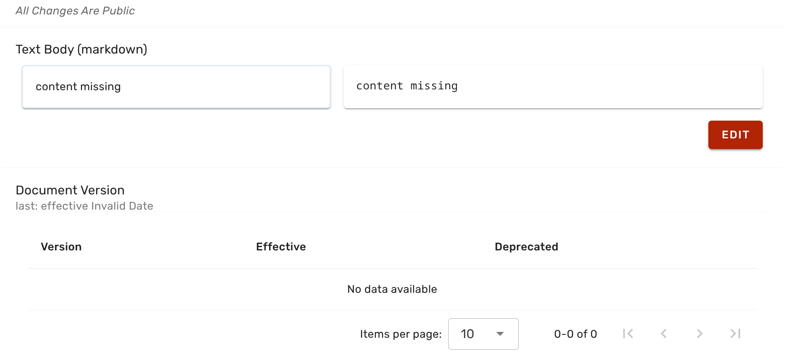
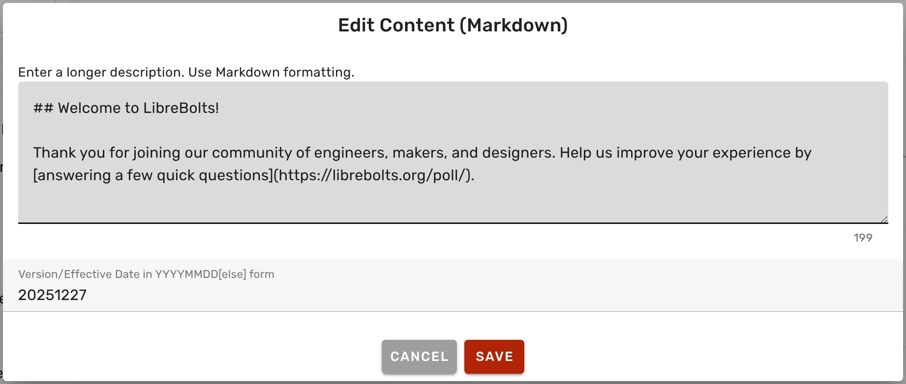
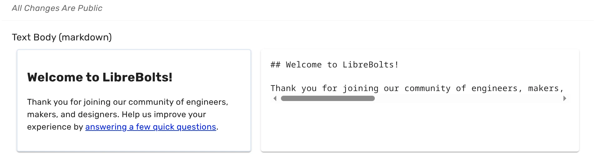
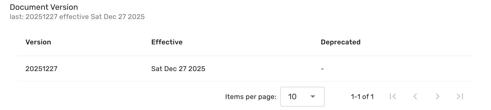

If you want to poll new users, you can set a custom survey prompt. Follow these steps:

{}

### Open the dashboard

[Open the dashboard](../../dashboard) and click on **Branding Configuration**.

### Open the Legal Documents section

On the **Branding Configuration** page, find the **Legal Documents** section, and click on the **Survey prompt** button.

### Start editing

By default, the survey prompt is empty and has the date when the Ondsel Lens instance was first created an launched.

Click on **Edit** below the entry field to start editing.

### Insert new survey prompt

Insert survey prompt text in Markdown formatting and click on **Save**

### Review changes

Saving will create a new revision and render the original text in Markdown and the preview:

The list of survey prompt revisions will be updated accordingly:

{}