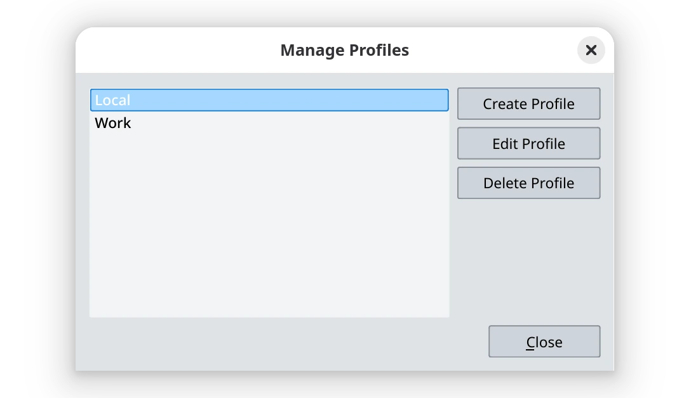

Pieter Hijma released the new version of the Lens addon with two major changes.

<!--more-->

## Server profiles

You can now switch between multiple Ondsel Lens servers using profiles:

The workflow is simple:

1. Create a new profile
2. Switch to it
3. Select **Log in** in the drop-down list
4. Submit your password
5. Start working

## New server version support

This simply tracks the evolution of the Ondsel Lens server / webapp. There's more work in progress, so stay tuned!