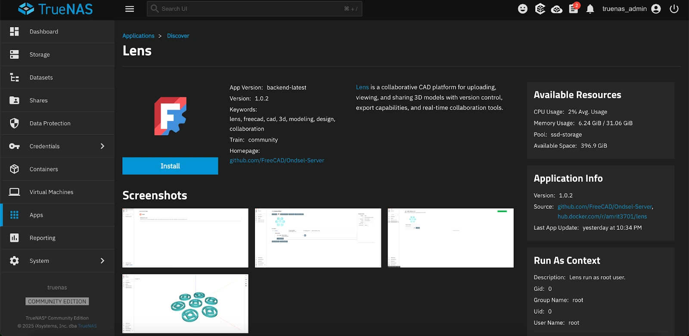

Amritpal Singh made the Lens app [available on the TrueNAS Apps Market](https://apps.truenas.com/catalog/lens/). Now users can install Lens directly from the TrueNAS Apps dashboard.

<!--more-->

Amritpal also wrote [detailed documentation](/administration/install/truenas-scale/) on setting everything up.

Work on TrueNAS integration was [sponsored](https://github.com/FreeCAD/FPA-grant-proposals/issues/60) from the Ondsel Onward fund through the FreeCAD Project Association's annual grant program.

Other deliverables of this grant are brand identity customization (already done) and an enhanced authentication system (planned).