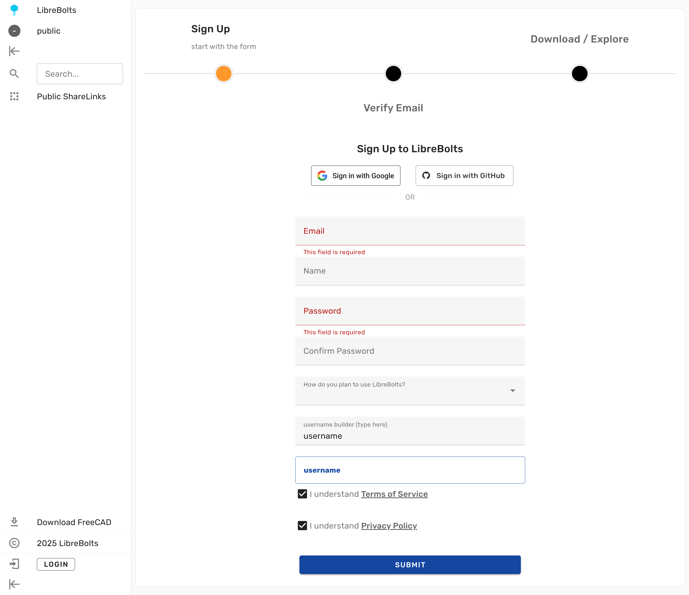

Amritpal Singh has just merged new code that adds OAuth authentication.

<!--more-->

The two supported ID providers are Google and GitHub:

The new authentication methods are disabled by default. You can enable them on the newly added **OAuth Configuration** page of the administration dashboard. Please see the [documentation](/administration/authentication) for details.

This work was sponsored from the Ondsel Onward fund via the FreeCAD Project Association.