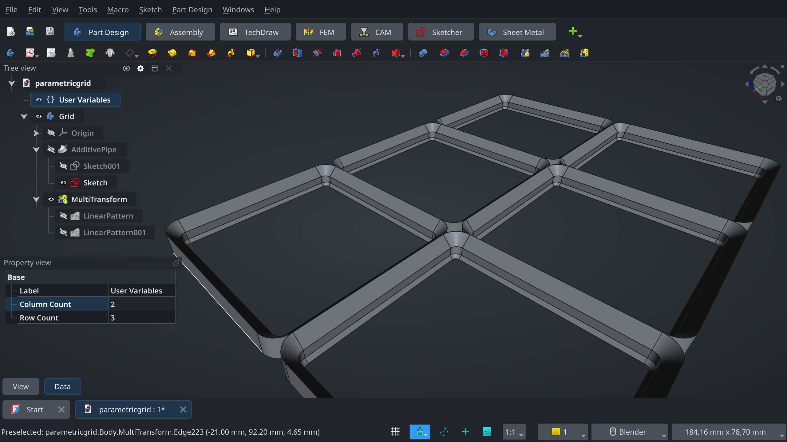
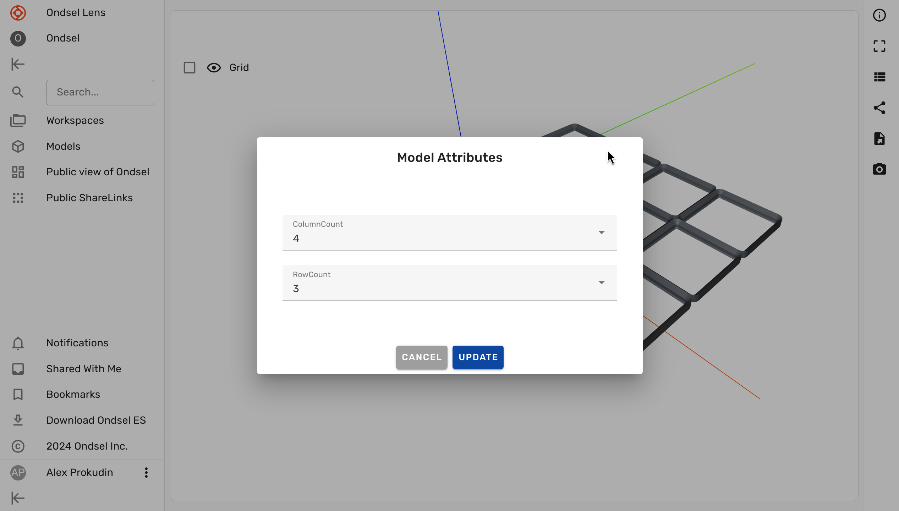

Ondsel Lens supports customizing parametric FreeCAD models created using the VarSets system. Custom properties created with VarSets are called model attributes on Lens.

An example of a parametric model would be this simple gridfinity implementation where users can customize the model by setting the number of rows and columns:

Users or Lens can access such a model and change the same properties:

Learn how to:

1. [Create model attributes](/docs/attributes/attributes-create/)
2. [Make model attributes accessible to other users](attributes-access)
<!-- 3. [Update model attributes](attributes-update) -->