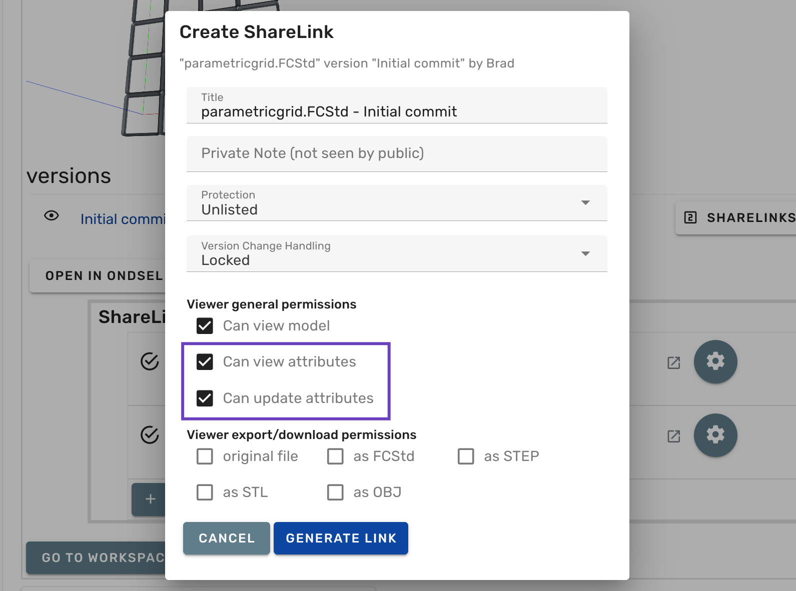

To make a parametric model accessible to other Lens users, do the following:

{}

### Start creating a new share link

Open the model of interest an start [creating a new share link](/docs/upload-share/public-share-links/).

### Enable attributes

Check the following two boxes: _Can view attributes_ and _Can update attributes_.

### Generate the link

Click **Generate Link** to create the share link.

{}

When a user opens a parametric model with attributes and starts updating it, Lens creates a copy of the original model in user's currently selected organization and performs all operations on that copy.